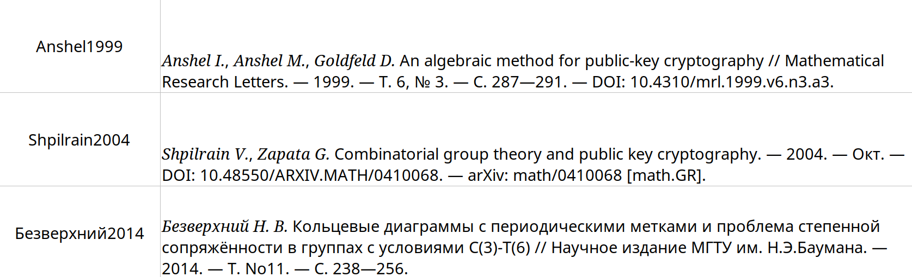

# bibtex2style

bibtex2style is a script that takes .bib file as an input and produces an .xlsx file with entries processed by biblatex with an according style (like `gost`). It also respects bold an italics fonts!

bibtex2style also adds cite keys to .xlsx file (see [example](#Example), so it should be made easy to find and manage citations.

By default bibtex2style uses [biblatex-gost](https://ctan.org/pkg/biblatex-gost) style. One can modify [tex source](https://github.com/heinwol/bibtex2style/blob/main/process_bib_file.tex#L15) to change the style (temporary solution). 

## Usage

Using the script is simple:
```bash
bibtex2style test.bib styled_result.xlsx
```
### Example

#### Input

`bibfile.bib` contents:
```tex
@article{Безверхний2014,
    author = {Безверхний, Н. В.},
    journal = {Научное издание МГТУ им. Н.Э.Баумана},
    title = {Кольцевые диаграммы с периодическими метками и проблема степенной
             сопряжённости в группах с условиями C(3)-T(6)},
    year = {2014},
    language = {ru},
    pages = {238--256},
    volume = {No11},
}

@article{Shpilrain2004,
    author = {Shpilrain, Vladimir and Zapata, Gabriel},
    title = {Combinatorial group theory and public key cryptography},
    year = {2004},
    month = oct,
    archiveprefix = {arXiv},
    copyright = {Assumed arXiv.org perpetual, non-exclusive license to
                 distribute this article for submissions made before January 2004
                 },
    doi = {10.48550/ARXIV.MATH/0410068},
    eprint = {math/0410068},
    file = {:http\://arxiv.org/pdf/math/0410068v1:PDF},
    keywords = {Group Theory (math.GR), Cryptography and Security (cs.CR), FOS:
                Mathematics, FOS: Computer and information sciences},
    primaryclass = {math.GR},
    publisher = {arXiv},
}

@article{Anshel1999,
    author = {Iris Anshel and Michael Anshel and Dorian Goldfeld},
    journal = {Mathematical Research Letters},
    title = {An algebraic method for public-key cryptography},
    year = {1999},
    number = {3},
    pages = {287--291},
    volume = {6},
    doi = {10.4310/mrl.1999.v6.n3.a3},
    priority = {prio2},
    publisher = {International Press of Boston},
}
```

#### Output

`styled_result.xlsx` contents:


## Installation

### Nix

If you happen to use [nix](https://nixos.org/learn.html) with flakes:
```bash
nix build github:heinwol/bibtex2style#default
```

### Manual

```bash
git clone https://github.com/heinwol/bibtex2style
cd bibtex2style
pip install poetry
poetry env use python
python bibtex2style.py test.bib styled_result.xlsx
```

Along with lines above you are expected to have some programs installed, see [Requirements](#Requirements).

## Requirements

- `python` with `pip` installed. I used 3.10, in theory it should work with several prior releases
- `Latex`. Whatever distribution and version of latex you can find **with the following packages**:
  - `latexmk`
  - `lualatex`
  - `biblatex`
  - `polyglossia`
  - `showkeys`
  - style package you want to use with `biblatex`, by default it is `biblatex-gost`
